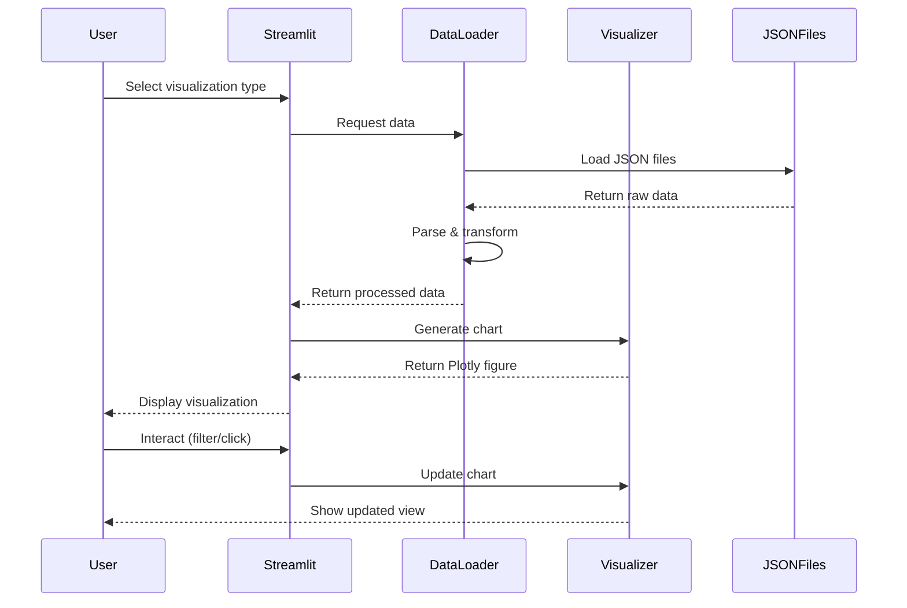

# Design Document

## Overview

MongoDB 데이터 시각화 도구는 Streamlit 기반의 Python 웹 애플리케이션으로, 다운로드된 JSON 데이터를 로드하여 정치 성향 분석, 토픽 인기도, 이슈 평가, 언론사 지지도 등을 인터랙티브하게 시각화합니다. Plotly를 사용하여 미려하고 반응형 차트를 제공하며, 사용자는 필터링, 클릭, 입력을 통해 데이터를 탐색할 수 있습니다.

### Technology Stack

- **Web Framework**: Streamlit (간단하고 빠른 데이터 앱 개발)
- **Visualization**: Plotly (인터랙티브 차트), WordCloud (워드클라우드)
- **Data Processing**: Pandas (데이터 조작 및 집계)
- **Package Manager**: uv
- **Language**: Python 3.11+

### Design Rationale

- **Streamlit 선택**: 빠른 프로토타이핑, 내장 위젯, 자동 리렌더링으로 개발 속도 향상
- **Plotly 선택**: 고품질 인터랙티브 차트, 줌/팬 기능, 호버 툴팁 지원
- **JSON 파일 기반**: 실제 MongoDB 연결 없이 데이터 분석 가능, 배포 간소화

## Architecture

### High-Level Architecture

```
┌─────────────────────────────────────────────────────────┐
│                    Streamlit Web App                     │
├─────────────────────────────────────────────────────────┤
│  ┌──────────────┐  ┌──────────────┐  ┌──────────────┐  │
│  │   Sidebar    │  │  Main View   │  │   Filters    │  │
│  │  Navigation  │  │ Visualization│  │   Controls   │  │
│  └──────────────┘  └──────────────┘  └──────────────┘  │
├─────────────────────────────────────────────────────────┤
│                  Visualization Layer                     │
│  ┌──────────────┐  ┌──────────────┐  ┌──────────────┐  │
│  │ Plotly Charts│  │  WordCloud   │  │  Aggregators │  │
│  └──────────────┘  └──────────────┘  └──────────────┘  │
├─────────────────────────────────────────────────────────┤
│                   Data Access Layer                      │
│  ┌──────────────┐  ┌──────────────┐  ┌──────────────┐  │
│  │ JSON Loader  │  │ Data Parser  │  │    Cache     │  │
│  └──────────────┘  └──────────────┘  └──────────────┘  │
├─────────────────────────────────────────────────────────┤
│                      Data Files                          │
│         data/*.json (MongoDB exports)                    │
└─────────────────────────────────────────────────────────┘
```

### Component Interaction Flow



## Components and Interfaces

### 1. Data Access Layer

#### DataLoader Module (`data_loader.py`)

**Responsibilities:**
- JSON 파일 로드 및 파싱
- MongoDB export 형식 ($oid, $date) 변환
- 데이터 캐싱

**Key Functions:**

```python
@st.cache_data
def load_users() -> pd.DataFrame:
    """Load and parse users.json"""
    
@st.cache_data
def load_political_score_history() -> pd.DataFrame:
    """Load and parse userPoliticalScoreHistory.json"""
    
@st.cache_data
def load_topics() -> pd.DataFrame:
    """Load and parse topics.json"""
    
@st.cache_data
def load_topic_subscriptions() -> pd.DataFrame:
    """Load and parse userTopicSubscriptions.json"""
    
@st.cache_data
def load_issues() -> pd.DataFrame:
    """Load and parse issues.json"""
    
@st.cache_data
def load_issue_evaluations() -> pd.DataFrame:
    """Load and parse userIssueEvaluations.json"""
    
@st.cache_data
def load_media_sources() -> pd.DataFrame:
    """Load and parse mediaSources.json"""

def parse_mongodb_date(date_obj: dict) -> datetime:
    """Convert MongoDB $date format to datetime"""
    
def parse_mongodb_oid(oid_obj: dict) -> str:
    """Convert MongoDB $oid format to string"""
```

**Caching Strategy:**
- Streamlit의 `@st.cache_data` 데코레이터 사용
- 앱 재실행 시 파일 재로드 방지
- 메모리 효율적인 데이터 공유

### 2. Visualization Layer

#### ChartGenerator Module (`visualizations/charts.py`)

**Responsibilities:**
- Plotly 차트 생성
- 일관된 스타일 적용
- 인터랙티브 기능 설정

**Key Functions:**

```python
def create_political_preference_pie_chart(df: pd.DataFrame) -> go.Figure:
    """Create pie chart for political preference distribution"""
    
def create_time_series_chart(
    df: pd.DataFrame,
    date_range: str,  # '7d' or '30d'
    view_type: str,   # 'category' or 'average'
    category: str = None
) -> go.Figure:
    """Create time-series chart for political score changes"""
    
def create_user_political_journey_chart(
    df: pd.DataFrame,
    user_id: str
) -> go.Figure:
    """Create individual user's political score history chart"""
    
def create_media_support_chart(
    df: pd.DataFrame,
    media_id: str = None,
    media_ids: list = None
) -> go.Figure:
    """Create cumulative media support chart for single or multiple media sources"""
    
def create_issue_evaluation_pie_chart(
    df: pd.DataFrame,
    issue_id: str
) -> go.Figure:
    """Create pie chart for issue evaluation distribution"""

def apply_chart_theme(fig: go.Figure) -> go.Figure:
    """Apply consistent theme to all charts"""
```

**Chart Theme:**
- Color palette: 진보(#E74C3C), 중도(#3498DB), 보수(#2ECC71)
- Modern gradient colors for enhanced visual appeal
- Font: 한글 지원 폰트
- Hover template: 상세 정보 표시
- Responsive layout
- Smooth animations and transitions (Requirement 10)

**Enhanced Visual Features (Requirement 10):**
- Plotly의 `update_layout()` 사용하여 애니메이션 효과 추가
- `hovermode='x unified'` 또는 `closest`로 향상된 호버 인터랙션
- Interactive legends with `legend.itemclick='toggle'`
- Modern template: `plotly_white` 또는 커스텀 테마
- Gradient fills for area charts using `fillgradient`

**Dynamic Axis Scaling (Requirement 11):**
- Y축 범위를 데이터의 min/max 기반으로 자동 계산
- 데이터 변화를 강조하기 위한 적절한 padding (5-10%)
- `yaxis.range` 설정으로 동적 스케일링 구현
- 작은 변화도 보이도록 확대된 범위 사용
- 수동 조정을 위한 `yaxis.fixedrange=False` 설정

#### WordCloudGenerator Module (`visualizations/wordcloud.py`)

**Responsibilities:**
- 토픽 워드클라우드 생성
- 구독자 수 기반 크기 조정

**Key Functions:**

```python
def create_topic_wordcloud(
    topics_df: pd.DataFrame,
    subscriptions_df: pd.DataFrame,
    top_n: int = 50
) -> Image:
    """Generate word cloud for top N topics by subscriber count"""
```

### 3. Data Processing Layer

#### Aggregators Module (`processing/aggregators.py`)

**Responsibilities:**
- 데이터 집계 및 변환
- 비즈니스 로직 처리

**Key Functions:**

```python
def aggregate_political_scores_by_date(
    history_df: pd.DataFrame,
    start_date: datetime,
    end_date: datetime
) -> pd.DataFrame:
    """Aggregate political scores by date for time-series analysis"""
    
def calculate_topic_subscriber_counts(
    topics_df: pd.DataFrame,
    subscriptions_df: pd.DataFrame
) -> pd.DataFrame:
    """Calculate subscriber count for each topic"""
    
def calculate_media_support_scores(
    evaluations_df: pd.DataFrame,
    issues_df: pd.DataFrame,
    media_df: pd.DataFrame
) -> pd.DataFrame:
    """Calculate cumulative support scores for media sources"""
    
def get_recent_issues(
    issues_df: pd.DataFrame,
    limit: int = 20
) -> pd.DataFrame:
    """Get most recent issues sorted by creation date"""
```

**Media Support Calculation Logic:**

1. 사용자가 이슈의 특정 성향(left/center/right)에 동의
2. 해당 이슈를 보도한 언론사 목록 조회 (issues.sources)
3. 동의한 성향과 일치하는 언론사에 지지도 +1
4. 시간순으로 누적 합계 계산

**Multi-Media Comparison (Requirement 13):**
- `calculate_media_support_scores()` 함수는 여러 언론사의 데이터를 동시에 반환
- 각 언론사별로 구분된 색상 사용
- 범례를 통해 언론사 식별
- 최대 5-7개 언론사까지 동시 표시 권장 (가독성 유지)

### 4. Application Layer

#### Main App (`app.py`)

**Responsibilities:**
- Streamlit 앱 진입점
- 페이지 라우팅
- 전역 설정

**Structure:**

```python
def main():
    st.set_page_config(
        page_title="MongoDB Data Visualization",
        page_icon="📊",
        layout="wide"
    )
    
    # Sidebar navigation
    page = st.sidebar.selectbox(
        "시각화 선택",
        [
            "전체 성향 분포",
            "시간별 성향 변화",
            "인기 토픽",
            "개인 성향 변화",
            "언론사 지지도",
            "이슈 평가 분포"
        ]
    )
    
    # Route to appropriate page
    if page == "전체 성향 분포":
        show_overall_preference_page()
    elif page == "시간별 성향 변화":
        show_time_series_page()
    # ... other pages
```

#### Page Modules (`pages/*.py`)

각 시각화 유형별로 독립적인 페이지 모듈:

- `pages/overall_preference.py`: 전체 성향 분포
- `pages/time_series.py`: 시간별 성향 변화
- `pages/topic_wordcloud.py`: 인기 토픽 워드클라우드
- `pages/user_journey.py`: 개인 성향 변화
- `pages/media_support.py`: 언론사 지지도 (단일 및 다중 비교 지원)
- `pages/issue_evaluation.py`: 이슈 평가 분포

**Page Integration Requirements (Requirement 12):**
- 모든 페이지는 main.py에서 올바르게 import되어야 함
- 각 페이지는 독립적으로 데이터를 로드하고 에러를 처리해야 함
- 일관된 레이아웃과 스타일을 유지해야 함
- 페이지별 에러 핸들링 및 사용자 피드백 제공

**Click-to-Select Interface (Requirement 14):**
- 모든 선택 가능한 항목(이슈, 언론사, 사용자)에 대해 클릭 가능한 UI 제공
- Streamlit의 `st.button()`, `st.radio()`, 또는 `st.selectbox()` 사용
- 선택 시 자동으로 시각화 업데이트
- 현재 선택된 항목 하이라이트 표시
- 수동 ID 입력 옵션도 유지 (고급 사용자용)

## Data Models

### Processed Data Structures

#### Political Score Time Series

```python
{
    'date': datetime,
    'category': str,  # politics, economy, society, culture, technology, international
    'left_score': float,
    'center_score': float,
    'right_score': float,
    'total_score': float
}
```

#### Topic Subscriber Count

```python
{
    'topic_id': str,
    'topic_name': str,
    'subscriber_count': int,
    'category': str
}
```

#### Media Support Score

```python
{
    'media_id': str,
    'media_name': str,
    'date': datetime,
    'cumulative_support': int,
    'perspective': str
}
```

#### Issue Evaluation Summary

```python
{
    'issue_id': str,
    'issue_title': str,
    'left_count': int,
    'center_count': int,
    'right_count': int,
    'total_count': int
}
```

## Error Handling

### Error Categories

1. **File Not Found Errors**
   - Display user-friendly message
   - Suggest checking data folder
   - Continue with available data

2. **Data Parsing Errors**
   - Log problematic records
   - Skip invalid entries
   - Show warning to user

3. **Invalid User Input**
   - Validate user ID / issue ID format
   - Show error message for non-existent IDs
   - Provide suggestions (e.g., recent issues)

4. **Empty Data Errors**
   - Handle cases with no data for selected filters
   - Display "No data available" message
   - Suggest alternative filters

### Error Handling Pattern

```python
try:
    data = load_data()
    if data.empty:
        st.warning("데이터가 없습니다.")
        return
    chart = create_chart(data)
    st.plotly_chart(chart)
except FileNotFoundError:
    st.error("데이터 파일을 찾을 수 없습니다. data 폴더를 확인해주세요.")
except Exception as e:
    st.error(f"오류가 발생했습니다: {str(e)}")
    logging.error(f"Error in visualization: {e}", exc_info=True)
```

## Testing Strategy

### Unit Testing

**Test Coverage:**
- Data loader functions (JSON parsing, date conversion)
- Aggregation functions (score calculation, counting)
- Data transformation logic

**Test Framework:** pytest

**Example Tests:**

```python
def test_parse_mongodb_date():
    """Test MongoDB date parsing"""
    
def test_aggregate_political_scores():
    """Test political score aggregation"""
    
def test_calculate_media_support():
    """Test media support score calculation"""
```

### Integration Testing

**Test Scenarios:**
- End-to-end data flow (load → process → visualize)
- Multiple data sources integration
- Filter and interaction logic

### Manual Testing

**Test Cases:**
- Visual inspection of charts
- Interactive features (zoom, hover, click)
- Responsive layout on different screen sizes
- Performance with full dataset

## Performance Considerations

### Optimization Strategies

1. **Data Caching**
   - Cache loaded JSON files with `@st.cache_data`
   - Cache expensive aggregations
   - Invalidate cache on data file changes

2. **Lazy Loading**
   - Load data only when page is accessed
   - Defer heavy computations until needed

3. **Data Sampling**
   - For large datasets, provide sampling options
   - Show top N items by default

4. **Efficient Aggregations**
   - Use Pandas vectorized operations
   - Avoid Python loops for large datasets
   - Pre-compute common aggregations

### Expected Performance

- Initial load: < 3 seconds
- Page navigation: < 1 second
- Chart interaction: < 500ms
- Data refresh: < 2 seconds

## Deployment

### Local Development

```bash
# Install dependencies
uv sync

# Run application
uv run streamlit run app.py
```

### Production Deployment Options

1. **Streamlit Cloud**: 무료 호스팅, GitHub 연동
2. **Docker**: 컨테이너화된 배포
3. **Self-hosted**: 서버에 직접 배포

### Configuration

**Environment Variables:**
- `DATA_DIR`: 데이터 파일 경로 (기본값: ./data)
- `CACHE_TTL`: 캐시 유효 시간 (기본값: 3600초)

## Implementation Details for New Requirements

### Enhanced Visual Quality (Requirement 10)

**Plotly Configuration:**
```python
def apply_enhanced_theme(fig: go.Figure) -> go.Figure:
    fig.update_layout(
        template='plotly_white',
        transition_duration=500,
        hovermode='x unified',
        legend=dict(
            itemclick='toggle',
            itemdoubleclick='toggleothers'
        ),
        font=dict(family='Noto Sans KR, sans-serif'),
        plot_bgcolor='rgba(0,0,0,0)',
        paper_bgcolor='rgba(0,0,0,0)'
    )
    return fig
```

### Dynamic Axis Scaling (Requirement 11)

**Auto-scaling Algorithm:**
```python
def calculate_optimal_y_range(data: pd.Series) -> tuple:
    """Calculate optimal y-axis range based on data variance"""
    min_val = data.min()
    max_val = data.max()
    data_range = max_val - min_val
    
    # Add 10% padding for better visibility
    padding = data_range * 0.1 if data_range > 0 else 1
    
    y_min = min_val - padding
    y_max = max_val + padding
    
    return (y_min, y_max)
```

### Multi-Media Comparison (Requirement 13)

**UI Design:**
- Streamlit multiselect widget for media source selection
- Color palette with distinct colors for each media
- Toggle between single and multi-view modes

**Implementation:**
```python
# In pages/media_support.py
selected_media = st.multiselect(
    "언론사 선택 (최대 7개)",
    options=media_list,
    default=[],
    max_selections=7
)

if len(selected_media) > 0:
    fig = create_media_support_chart(df, media_ids=selected_media)
```

### Click-to-Select Interface (Requirement 14)

**UI Pattern:**
```python
# Display clickable list
col1, col2 = st.columns([1, 3])

with col1:
    st.subheader("최근 이슈")
    for issue in recent_issues:
        if st.button(issue['title'][:30], key=issue['id']):
            st.session_state.selected_issue = issue['id']

with col2:
    if 'selected_issue' in st.session_state:
        display_issue_chart(st.session_state.selected_issue)
```

### Page Integration Fix (Requirement 12)

**Main App Structure:**
```python
# main.py
import streamlit as st
from pages import (
    overall_preference,
    time_series,
    topic_wordcloud,
    user_journey,
    media_support,
    issue_evaluation
)

# Ensure all pages are properly imported and callable
page_functions = {
    "전체 성향 분포": overall_preference.show,
    "시간별 성향 변화": time_series.show,
    "인기 토픽": topic_wordcloud.show,
    "개인 성향 변화": user_journey.show,
    "언론사 지지도": media_support.show,
    "이슈 평가 분포": issue_evaluation.show
}
```

## Future Enhancements

1. **Real-time MongoDB Connection**: 실시간 데이터 연동 옵션
2. **Export Functionality**: 차트를 이미지/PDF로 내보내기
3. **Advanced Filters**: 날짜 범위, 카테고리, 성향 필터 조합
4. **Dashboard**: 주요 지표를 한 화면에 표시
5. **Data Refresh**: 데이터 파일 자동 갱신 기능
6. **User Comparison**: 여러 사용자의 정치 성향 변화 비교
